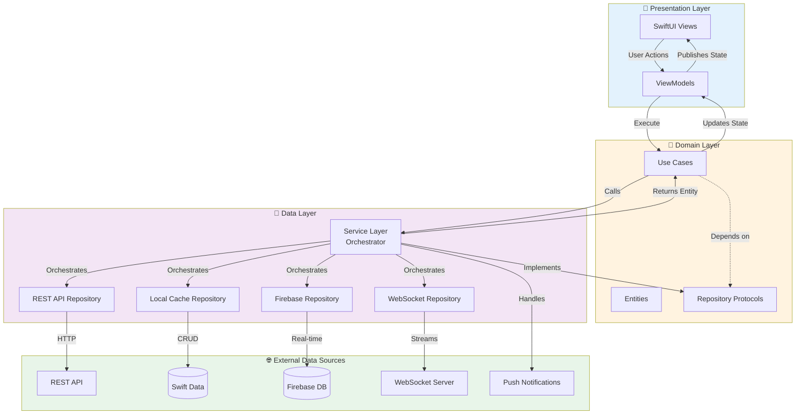
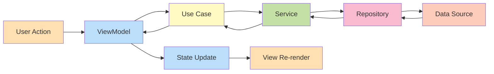
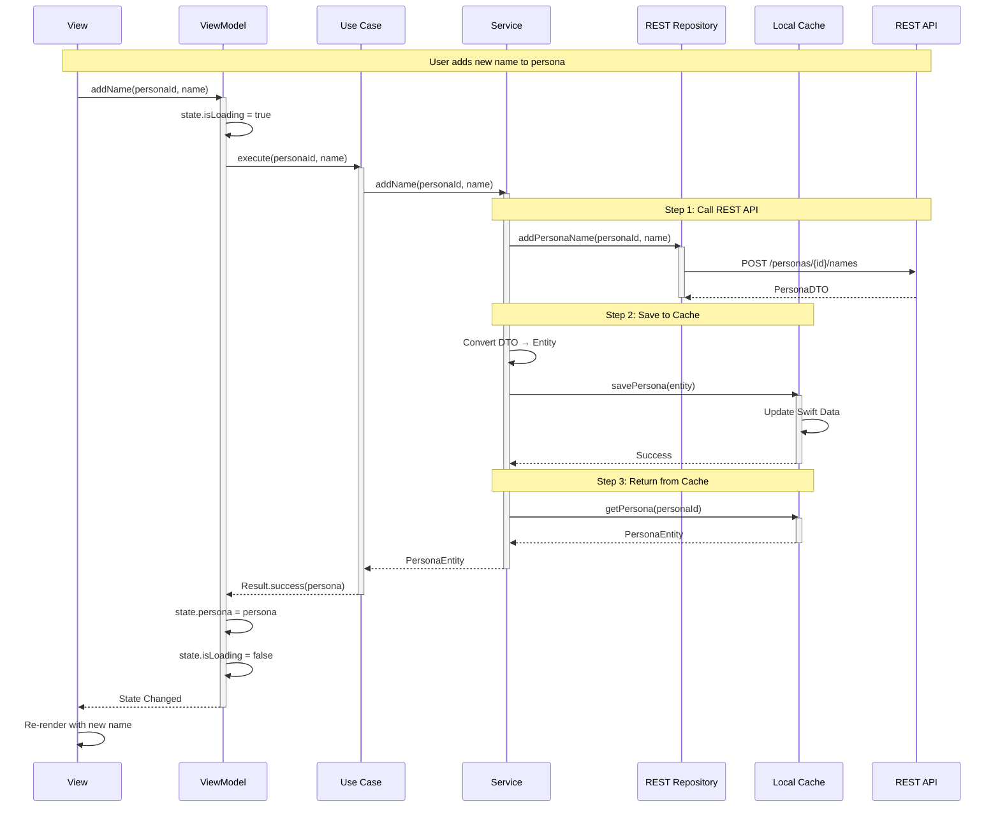
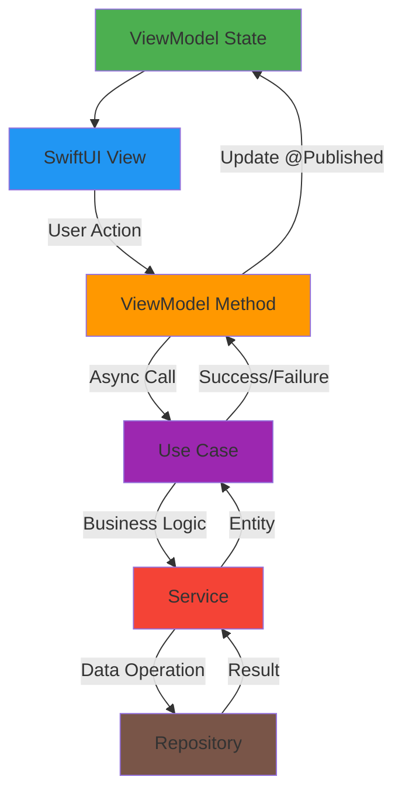

# SwiftUI + MVVM + Unidirectional Data Flow + Clean Architecture

This architecture combines **MVVM (Model-View-ViewModel)** with **Clean Architecture** principles and **Unidirectional Data Flow** to create a scalable, maintainable iOS application using SwiftUI.

## Table of Contents

1. [Architecture Overview](https://www.notion.so/SwiftUI-MVVM-Unidirectional-Data-Flow-Clean-Architecture-2ed2f88a1e158053af54d84300df31a3?pvs=21)
2. [Core Principles](https://www.notion.so/SwiftUI-MVVM-Unidirectional-Data-Flow-Clean-Architecture-2ed2f88a1e158053af54d84300df31a3?pvs=21)
3. [Layer Architecture](https://www.notion.so/SwiftUI-MVVM-Unidirectional-Data-Flow-Clean-Architecture-2ed2f88a1e158053af54d84300df31a3?pvs=21)
4. [Technology Stack](https://www.notion.so/2e72f88a1e15805abb4ac0a92a2a321b?pvs=21)
5. [Data Flow Patterns](https://www.notion.so/SwiftUI-MVVM-Unidirectional-Data-Flow-Clean-Architecture-2ed2f88a1e158053af54d84300df31a3?pvs=21)
6. [MVVM Implementation](https://www.notion.so/2e72f88a1e15805abb4ac0a92a2a321b?pvs=21)
7. [Testing Strategy](https://www.notion.so/Testing-Strategy-2ed2f88a1e15800b8d57ecf5b328b9cb?pvs=21)
8. [Best Practices](https://www.notion.so/SwiftUI-MVVM-Unidirectional-Data-Flow-Clean-Architecture-2ed2f88a1e158053af54d84300df31a3?pvs=21)

## 1. Architecture Overview

### Key Benefits

- **Separation of Concerns**: Clear boundaries between layers
- **Testability**: Each layer can be tested independently with mocks
- **Scalability**: Easy to add new features without breaking existing code
- **Maintainability**: Changes in one layer minimally impact others
- **Flexibility**: Can swap implementations (REST API → GraphQL, etc.)

## 2. Core Principles

### Clean Architecture Principles

1. **Dependency Rule**: Dependencies point inward
    - **Presentation** depends on **Domain**
    - **Data** depends on **Domain**
    - **Domain** depends on nothing
2. **Abstraction over Implementation**
    - **Domain** defines protocols (contracts)
    - **Data** implements protocols
    - **Presentation** depends only on abstractions
3. **Business Logic Isolation**
    - Core business rules live in Use Cases
    - Independent of UI, frameworks, and databases

### Unidirectional Data Flow

**Flow Rules:**

- **State** flows down from **ViewModel** to **View**
- Events flow up from **View** to **ViewModel**
- **Data** transformations happen at layer boundaries
- Single source of truth (**ViewModel** state)

### MVVM Pattern

- **View/Screen**: Declarative UI (SwiftUI), observes ViewModel state
- **ViewModel**: Manages UI state, coordinates Use Cases, no business logic
- **Model**: Domain entities and Use Cases (business logic)

## 3. Layer Architecture

### 3.1 Presentation Layer

**Responsibility**: Display data and capture user interactions

**Components:**

- **Views**: SwiftUI views that render UI based on state
- **ViewModels**: Manage UI state, handle user actions, coordinate Use Cases

**Rules:**

- Views are stateless and declarative
- ViewModels contain no business logic
- All async operations return to main thread
- Use `@Published` for reactive state updates

### 3.2 Domain Layer

**Responsibility**: Business logic and rules

**Components:**

- **Use Cases**: Single-responsibility business operations
- **Entities**: Core business models (value types)
- **Repository Protocols**: Abstract data access contracts

**Rules:**

- Pure Swift (no UIKit, SwiftUI, third-party dependencies)
- Defines interfaces, doesn't implement data access
- Contains validation and business rules
- Framework-independent

### 3.3 Data Layer

**Responsibility**: Data persistence and external communication

**Components:**

- **Service Layer**: Orchestrates multiple repositories
- **Repositories**: Implement domain protocols
- **Data Sources**: REST API, Swift Data, Firebase, WebSocket

**Rules:**

- Implements protocols from Domain layer
- Handles DTO ↔ Entity mapping
- Manages caching strategies
- Handles errors and transforms them for domain

## 4. Technology Stack

### Core Technologies

| Technology | Purpose |
| --- | --- |
| SwiftUI | Declarative UI framework |
| Combine | Reactive programming & state management |
| Async/Await | Modern concurrency for async operations |
| Swift Data | Local persistence & caching |

### Data Sources

| Source | Use Case |
| --- | --- |
| REST API | Primary data source |
| Swift Data | Local caching & offline support |
| Firebase DB | Real-time data synchronization |
| WebSocket | Bidirectional live communication |
| Push Notifications | Remote updates & triggers |

## 5. Data Flow Patterns

### 5.1 Complete Data Flow: Add Name to Persona

### 5.2 MVVM State Management

[MVVM Implementation](https://www.notion.so/MVVM-Implementation-2ed2f88a1e1580e4bd83f9446a81abb8?pvs=21)

[Testing Strategy](https://www.notion.so/Testing-Strategy-2ed2f88a1e15800b8d57ecf5b328b9cb?pvs=21)

## 8. Best Practices

### 8.1 Architecture Guidelines

**Keep Layers Pure:**

- **Domain layer** has no dependencies on outer layers
- Use **dependency injection** throughout
- Define protocols in **Domain**, implement in **Data**

**State Management:**

- Single source of truth (**ViewModel** state)
- Use value types (structs) for state
- Make state updates explicit and traceable

**Error Handling:**

- Create custom errors for each layer
- Transform errors at layer boundaries
- Provide meaningful user-facing messages

### 8.2 Async vs Combine

**Use Async/Await for:**

- Sequential operations
- Simple request-response patterns
- New code (modern Swift)

**Use Combine for:**

- Multiple simultaneous streams
- Complex reactive transformations
- Debouncing/throttling user input
- Event-driven architectures

**Can Mix Both:**

- **ViewModels** can expose both interfaces
- Use `async` in newer iOS versions
- Bridge with `.values` or `Future`

### 8.3 Performance Tips

1. **Caching Strategy:**
    - Cache frequently accessed data
    - Implement cache expiration
    - Use background contexts for writes
2. **Swift Data:**
    - Use predicates for efficient queries
    - Batch operations when possible
    - Index frequently queried properties
3. **Network:**
    - Implement request cancellation
    - Use `URLSession` configuration
    - Handle background downloads
4. **UI:**
    - Keep ViewModels on `@MainActor`
    - Use `@Published` sparingly
    - Debounce user input

---

## Summary

This architecture provides a robust foundation for large-scale iOS applications with:

✅ **Clear Separation of Concerns** - Each layer has a single responsibility

✅ **Testability** - Easy to test with mocks at every layer

✅ **Maintainability** - Changes isolated to specific layers

✅ **Scalability** - Easy to add features following established patterns

✅ **Flexibility** - Can swap implementations (API, database, UI)