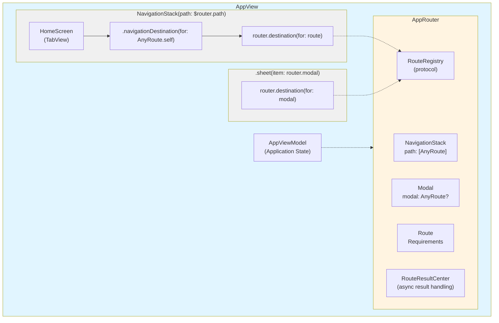
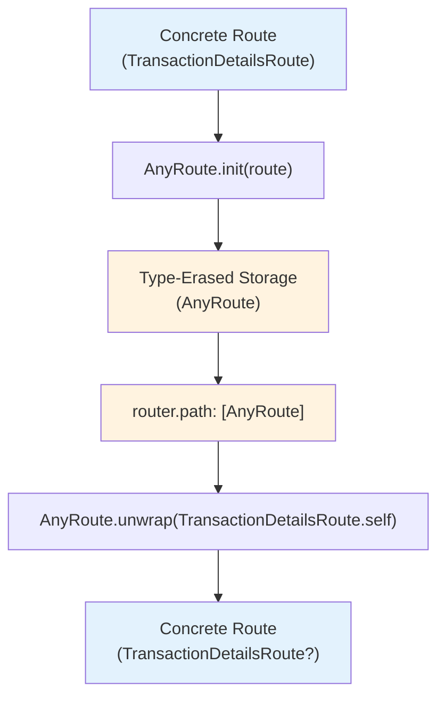
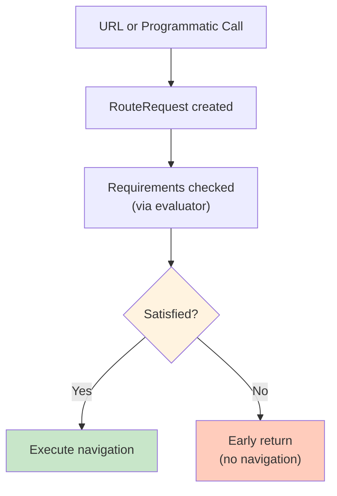
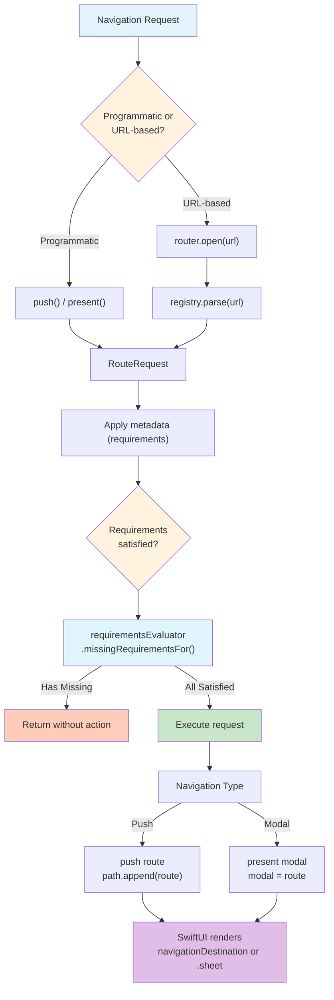
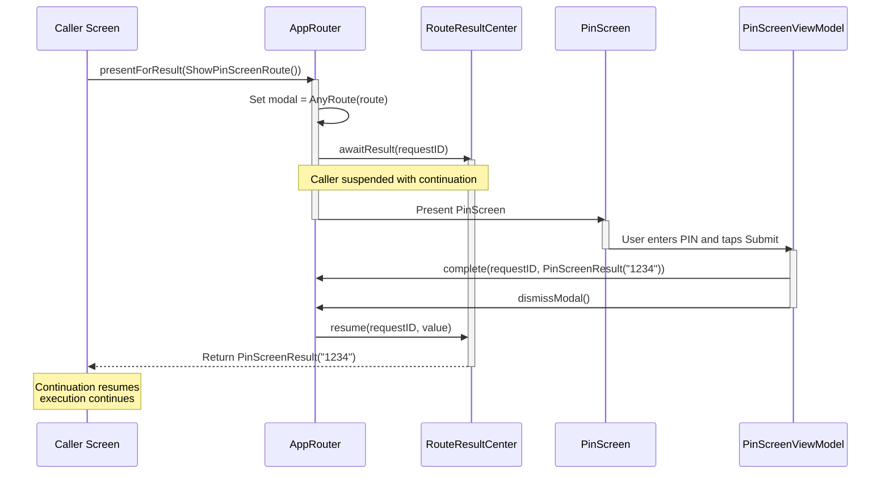
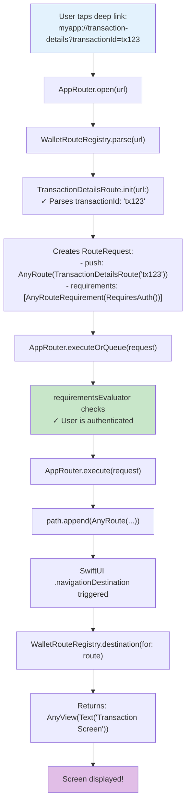
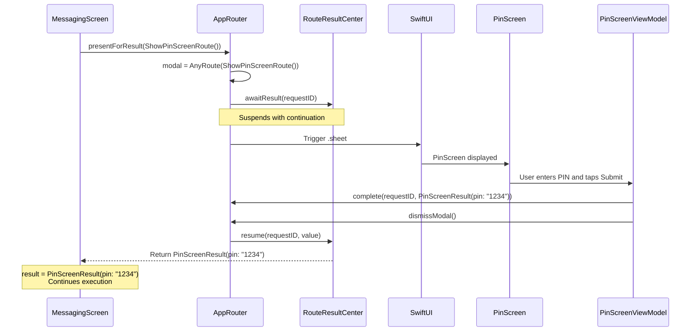
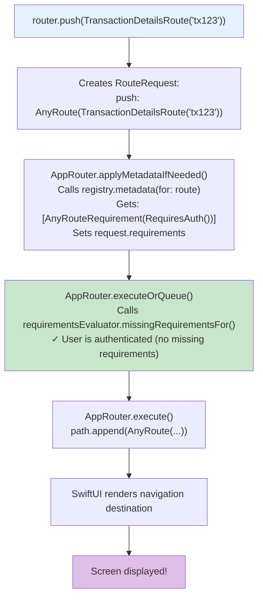

# Navigation

## Overview

This navigation system provides a flexible, type-safe routing architecture that supports:

- **Programmatic navigation** (push/present routes from code)
- **URL-based navigation** (deep links and universal links)
- **Result-returning routes** (async/await pattern for flows that need to return values)
- **Route requirements** (authentication, onboarding checks)
- **Modular route registration** (feature-based route registries)

## Architecture Diagram



## Core Components

### 1. Route Protocol

**File:** `Route.swift`

```swift
public protocol Route: Hashable, Sendable {
    static var path: String { get }
    init?(url: URL)
}

```

**Purpose:** Defines the contract for all routes in the application.

**Key Features:**

- `path`: Canonical path for URL matching (e.g., "transaction-details")
  - Can match either URL path component or host (depending on URL structure)
  - No leading slash required
- `init?(url:)`: Failable initializer for parsing routes from URLs
  - Uses `URLComponents` to parse URL structure
  - Returns `nil` when URL doesn't match this route
- `Hashable`: Enables routes to be used in navigation stacks
- `Sendable`: Thread-safe for Swift Concurrency

**Example Implementation:**

```swift
struct TransactionDetailsRoute: Route {
    static let path = "transaction-details"
    let transactionID: String

    init(_ transactionId: String) {
        self.transactionID = transactionId
    }

    init?(url: URL) {
        guard let components = URLComponents(url: url, resolvingAgainstBaseURL: false) else {
            return nil
        }
        guard components.path == Self.path || components.host == Self.path else {
            return nil
        }
        guard let id = components.queryItems?.first(where: { $0.name == "transactionId" })?.value else {
            return nil
        }
        self.transactionID = id
    }
}
```

### 2. AnyRoute (Type Erasure)

**File:** `AnyRoute.swift`

```swift
public struct AnyRoute: Hashable, Sendable, Identifiable {
    public init<R: Route>(_ route: R)
    public func unwrap<R: Route>(_ type: R.Type) -> R?
    public var id: Int { hashValue }
}
```

**Purpose:** Type-erased wrapper that allows heterogeneous `Route` values to be stored in a single `NavigationStack` path array and extend the ability how the routes can be modeled. `AnyRoute` conforms to `Identifiable` directly, making it usable with SwiftUI's `.sheet(item:)` modifier without additional wrapper types.

**Why It's Needed:**
SwiftUI's `NavigationStack` requires a homogeneous collection for its path. Since we have multiple route types (e.g., `TransactionDetailsRoute`, `ShowPinScreenRoute`), we need a type-erased wrapper to store them together.

**Flow Diagram:**



### 3. RouteRequest

**File:** `RouteRequest.swift`

```swift
public struct RouteRequest {
    public var push: AnyRoute?
    public var presentModal: AnyRoute?
    public var requirements: RouteRequirements = []
}

```

**Purpose:** Rich routing intent that encapsulates navigation actions and their requirements.

**Components:**

- `push`: Route to push onto the navigation stack
- `presentModal`: Route to present as a modal/sheet
- `requirements`: Access requirements (auth, onboarding, etc.)

**Usage Flow:**



### 4. RouteRequirements

**Files:** `RouteRequirement.swift`

```swift
/// Protocol for defining route requirements
public protocol RouteRequirement: Hashable { }

/// Type-erased wrapper for any requirement
public struct AnyRouteRequirement: Hashable {
    public init<R: RouteRequirement>(_ value: R)
    public func unwrap<R: RouteRequirement>(_ type: R.Type) -> R?
}

/// Set of type-erased requirements
public typealias RouteRequirements = Set<AnyRouteRequirement>
```

**Purpose:** Define prerequisites for navigation (authentication, onboarding completion, etc.) using a flexible, extensible system where any type can be a requirement.

**Example Implementation:**

```swift
// Define your requirement types
struct RequiresAuth: RouteRequirement { }
struct RequiresOnboarding: RouteRequirement { }

// Use in metadata
func metadata(for route: AnyRoute) -> RouteRequirements? {
    if route.unwrap(TransactionDetailsRoute.self) != nil {
        return [AnyRouteRequirement(RequiresAuth())]
    }
    return nil
}
```

**Key Design:**
- Protocol-based instead of OptionSet for better extensibility
- Type-erased storage allows mixing different requirement types
- Each module can define its own requirement types

### 5. RouteRequirementsEvaluator

**File:** `RouteRequirementsEvaluator.swift`

```swift
public protocol RouteRequirementsEvaluator {
    func missingRequirementsFor(_ requirements: RouteRequirements) -> RouteRequirements
}
```

**Purpose:** Abstraction for evaluating whether route requirements are satisfied. Separates requirement evaluation logic from the router.

**Implementation Pattern:**

```swift
class AppRequirementsEvaluator: RouteRequirementsEvaluator {
    private let authManager: AuthManager
    private let onboardingManager: OnboardingManager

    func missingRequirementsFor(_ requirements: RouteRequirements) -> RouteRequirements {
        var missing = RouteRequirements()

        for requirement in requirements {
            if let authReq = requirement.unwrap(RequiresAuth.self) {
                if !authManager.isAuthenticated {
                    missing.insert(requirement)
                }
            }
            else if let onboardingReq = requirement.unwrap(RequiresOnboarding.self) {
                if !onboardingManager.isCompleted {
                    missing.insert(requirement)
                }
            }
        }

        return missing
    }
}
```

**Benefits:**
- Decouples requirement checking from navigation logic
- Makes testing easier (can mock the evaluator)
- Allows different evaluation strategies without modifying the router

### 6. AppRouter

**File:** `AppRouter.swift`

The central coordinator for all navigation in the application.

**Key Properties:**

```swift
@Published public var path: [AnyRoute] = []                       // Navigation stack
@Published public var modal: AnyRoute?                            // Current modal
public let registry: RouteRegistry                                 // Route resolver
public let requirementsEvaluator: RouteRequirementsEvaluator      // Requirements checker
public let results: RouteResultCenter = .init()                   // Result handling
```

**Navigation Methods:**

### Push Navigation

```swift
router.push(TransactionDetailsRoute("tx123"))

```

### Modal Presentation

```swift
router.present(ShowPinScreenRoute())

```

### Result-Returning Navigation

```swift
let pin = await router.presentForResult(ShowPinScreenRoute(), expecting: PinScreenResult.self)
// User enters PIN in modal
// Modal calls: router.complete(route.requestID, with: PinScreenResult(pin: "1234"))
// Continuation resumes with result

```

### URL-Based Navigation

```swift
router.open(URL(string: "myapp://transaction-details?transactionId=tx123")!)
```

### Check URL Support

```swift
let result = router.canOpen(URL(string: "myapp://transaction-details?transactionId=tx123")!)
switch result {
case .canOpenURL:
    print("URL can be opened")
case .notSupportedURL:
    print("URL not supported by any registry")
case .missingRequirements(let requirements):
    print("URL supported but missing requirements: \(requirements)")
}
```

**AppRouter Flow Diagram:**



### 7. RouteRegistry Protocol

**File:** `RouteRegistry.swift`

```swift
public protocol RouteRegistry {
    func parse(_ url: URL) -> RouteRequest?
    func destination(for route: AnyRoute) -> AnyView?
    func metadata(for route: AnyRoute) -> RouteRequirements?
}

```

**Purpose:** Abstraction for route resolution and view construction.

**Methods:**

- `parse(_:)`: Convert URL to RouteRequest
- `destination(for:)`: Build SwiftUI view for a route
- `metadata(for:)`: Define requirements for a route

**Implementation Pattern:**

```swift
class PinRouteRegistry: RouteRegistry {
    weak var router: AppRouter?

    func parse(_ url: URL) -> RouteRequest? {
        guard let route = ShowPinScreenRoute(url: url) else {
            return nil
        }
        // Note: Currently returns nil because ShowPinScreenRoute(url:) always returns nil
        // This route is only used programmatically
        return nil
    }

    func destination(for route: AnyRoute) -> AnyView? {
        if let pinRoute = route.unwrap(ShowPinScreenRoute.self), let router {
            return AnyView(PinScreen(
                viewModel: PinScreenViewModel(route: pinRoute, router: router)
            ))
        }
        return nil
    }

    func metadata(for route: AnyRoute) -> RouteRequirements? {
        if route.unwrap(ShowPinScreenRoute.self) != nil {
            return [AnyRouteRequirement(RequiresAuth())]
        }
        return nil
    }
}

```

### 8. RouteResults System

**File:** `RouteResults.swift`

Enables async/await pattern for routes that return values to their caller.

**Components:**

### RouteRequestID

```swift
public struct RouteRequestID: Hashable, Sendable {
    public let rawValue = UUID()
}

```

Unique identifier for tracking result-returning navigation flows.

### RequestIdentifiable Protocol

```swift
public protocol RequestIdentifiable: Sendable {
    var requestID: RouteRequestID { get }
}

```

Routes conforming to this protocol can return results.

### RouteResultCenter

```swift
public final class RouteResultCenter: ObservableObject {
    func awaitResult<T: Sendable>(for id: RouteRequestID, as type: T.Type) async -> T
    func resume<T: Sendable>(_ id: RouteRequestID, with value: T)
    func cancel(_ id: RouteRequestID)
}

```

**Result-Returning Flow:**



## Navigation Types

### Stack Navigation (Push)

Used for hierarchical navigation where users can go back.

```swift
// From code
router.push(TransactionDetailsRoute("tx123"))

// From URL
router.open(URL(string: "myapp://transaction-details?transactionId=tx123")!)

```

**SwiftUI Integration:**

```swift
NavigationStack(path: $router.path) {
    HomeScreen(router: router)
        .navigationDestination(for: AnyRoute.self) { route in
            router.destination(for: route) ?? AnyView(EmptyView())
        }
}

```

### Modal Presentation (Present)

Used for temporary, modal experiences that are dismissed.

```swift
// From code
router.present(ShowPinScreenRoute())

// From URL (if registry configures it as modal)
router.open(URL(string: "myapp://show-pin-screen")!)

```

**SwiftUI Integration:**

```swift
.sheet(item: $router.modal) { route in
    router.destination(for: route) ?? AnyView(EmptyView())
}
```

**Note:** Since `AnyRoute` conforms to `Identifiable`, it can be used directly with `.sheet(item:)` without wrapper types.

## Complete Navigation Flow Examples

### Example 1: Simple Navigation from URL



### Example 2: Result-Returning Modal Flow

```swift
// In MessagingScreen
Task {
    let result = await router.presentForResult(
        ShowPinScreenRoute(),
        expecting: PinScreenResult.self
    )
    print("User entered PIN: \\(result.pin)")
    // Continue with decryption...
}

```

**Flow:**



### Example 3: Programmatic Navigation

```swift
// In WalletScreen, user taps a transaction
Button("View Details") {
    router.push(TransactionDetailsRoute("tx123"))
}

```

**Flow:**



## Modular Route Registries

The system supports multiple route registries for different features/modules.

**Example Registries:**

1. **PinRouteRegistry** - Handles PIN screen routes
2. **WalletRouteRegistry** - Handles transaction/wallet routes
3. **MessagingRouteRegistry** - Handles chat routes

**Composite Pattern (Recommended):**

```swift
public struct AppRouteRegistry: Sendable, RouteRegistry {
    private var registries: [RouteRegistry]

    public init(registries: [RouteRegistry]) {
        self.registries = registries
    }

    public func parse(_ url: URL) -> RouteRequest? {
        self.registries.firstMatching { $0.parse(url) }
    }

    public func destination(for route: AnyRoute) -> AnyView? {
        self.registries.firstMatching { $0.destination(for: route) }
    }

    public func metadata(for route: AnyRoute) -> RouteRequirements? {
        self.registries.firstMatching { $0.metadata(for: route) }
    }
}

// Usage in app initialization:
let appRouter = AppRouter(
    registry: AppRouteRegistry(registries: [
        PinRouteRegistry(),
        WalletRouteRegistry(),
        MessagingRouteRegistry()
    ]),
    requirementsEvaluator: AppRequirementsEvaluator()
)
```

**Note:** The `firstMatching` extension on `Sequence` provides a clean way to find the first non-nil result from the registries.

**Reference Implementation:**

See `Sources/Application/Routing/AppRegistry.swift` for the production implementation of the composite pattern using `AppRouteRegistry`.

## Best Practices

### 1. Route Design

✅ **DO:**

- Make routes `struct` for value semantics
- Include all necessary data in the route itself
- Use descriptive, URL-friendly paths
- Mark routes as `nonisolated` if they're simple value types

❌ **DON'T:**

- Put business logic in routes
- Make routes classes unless necessary
- Use complex objects that can't be parsed from URLs

### 2. Registry Organization

✅ **DO:**

- Create one registry per feature/module
- Use weak references to AppRouter to avoid retain cycles
- Return `nil` from `parse()` if URL doesn't match
- Return `nil` from `destination()` if route type doesn't match

❌ **DON'T:**

- Create a single monolithic registry
- Throw errors from parse/destination methods
- Forget to check route types before unwrapping

### 3. Result-Returning Routes

✅ **DO:**

- Use `RequestIdentifiable` for routes that return values
- Create dedicated result types that are `Sendable`
- Complete or cancel results before dismissing
- Handle cancellation gracefully

❌ **DON'T:**

- Forget to call `router.complete()` or `router.cancel()`
- Use non-`Sendable` types for results
- Leave continuations hanging

### 4. Requirements

✅ **DO:**

- Define custom requirement types conforming to `RouteRequirement`
- Return requirements in registry's `metadata()` method
- Implement `RouteRequirementsEvaluator` to check requirement satisfaction
- Use type-safe requirement checking with `unwrap(_:)`

❌ **DON'T:**

- Hardcode requirement checks in view code
- Mix requirement types without proper unwrapping
- Return requirements directly from AppRouter (use the evaluator)

## Integration with AppView

The `AppView` is the root view that integrates the navigation system:

```swift
struct AppView: View {
    @ObservedObject private var viewModel: AppViewModel
    @ObservedObject private var router: AppRouter

    var body: some View {
        Group {
            switch viewModel.applicationState {
            case .initializing:
                Text("Splash screen")
            case .unauthenticated:
                Text("Unauthenticated")
            case .authenticated:
                // Navigation stack for push navigation
                NavigationStack(path: $router.path) {
                    HomeScreen(router: router)
                        .navigationDestination(for: AnyRoute.self) { route in
                            router.destination(for: route) ?? AnyView(EmptyView())
                        }
                }
                // Sheet for modal presentation
                .sheet(item: $router.modal) { route in
                    router.destination(for: route) ?? AnyView(Text("Placeholder"))
                }
            }
        }
    }
}
```

**Key Points:**

- Navigation only active in `.authenticated` state
- Single `NavigationStack` for entire app
- Single `.sheet` modifier for all modals
- `AnyRoute` is `Identifiable` so can be used directly with `.sheet(item:)`

## Testing Strategy

### Testing Routes

```swift
import Testing

@Suite("TransactionDetailsRoute Tests")
struct TransactionDetailsRouteTests {

    @Test("Parse valid URL")
    func parseValidURL() {
        let url = URL(string: "myapp://transaction-details?transactionId=tx123")!
        let route = TransactionDetailsRoute(url: url)

        #expect(route != nil)
        #expect(route?.transactionId == "tx123")
    }

    @Test("Parse invalid URL returns nil")
    func parseInvalidURL() {
        let url = URL(string: "myapp://wrong-path")!
        let route = TransactionDetailsRoute(url: url)

        #expect(route == nil)
    }
}

```

### Testing Registries

```swift
@Suite("WalletRouteRegistry Tests")
struct WalletRouteRegistryTests {

    @Test("Parse transaction URL")
    func parseTransactionURL() {
        let registry = WalletRouteRegistry()
        let url = URL(string: "myapp://transaction-details?transactionId=tx123")!
        let request = registry.parse(url)

        #expect(request != nil)
        #expect(request?.push != nil)
        #expect(request?.requirements.contains(AnyRouteRequirement(RequiresAuth())) == true)
    }

    @Test("Destination for transaction route")
    func destinationForRoute() {
        let registry = WalletRouteRegistry()
        let route = AnyRoute(TransactionDetailsRoute("tx123"))
        let view = registry.destination(for: route)

        #expect(view != nil)
    }
}

```

### Testing AppRouter

```swift
@Suite("AppRouter Tests")
@MainActor
struct AppRouterTests {

    @Test("Push adds to path")
    func pushAddsToPath() {
        let registry = WalletRouteRegistry()
        let router = AppRouter(registry: registry)

        router.push(TransactionDetailsRoute("tx123"))

        #expect(router.path.count == 1)
    }

    @Test("Present sets modal")
    func presentSetsModal() {
        let registry = PinRouteRegistry()
        let router = AppRouter(registry: registry)

        router.present(ShowPinScreenRoute())

        #expect(router.modal != nil)
    }

    @Test("Result-returning flow")
    func resultReturningFlow() async {
        let registry = PinRouteRegistry()
        let router = AppRouter(registry: registry)
        let route = ShowPinScreenRoute()

        Task {
            let result = await router.presentForResult(route, expecting: PinScreenResult.self)
            #expect(result.pin == "1234")
        }

        // Simulate user completing flow
        try? await Task.sleep(for: .milliseconds(100))
        router.complete(route.requestID, with: PinScreenResult(pin: "1234"))
    }
}

```

## Common Patterns

### Pattern 1: Feature-Based Navigation Module

```swift
// WalletNavigation.swift
enum WalletNavigation {
    // Routes
    struct TransactionDetailsRoute: Route { ... }
    struct TransactionHistoryRoute: Route { ... }

    // Registry
    class Registry: RouteRegistry { ... }

    // Helper extensions
    extension AppRouter {
        func showTransactionDetails(_ id: String) {
            push(TransactionDetailsRoute(id))
        }
    }
}

```

### Pattern 2: Deep Link URL Scheme

```
myapp://[route-path]?[params]

Examples:
myapp://transaction-details?transactionId=tx123
myapp://conversation?conversationId=conv456
myapp://verify-identity?documentId=doc789
```

**Note:** Routes match against the URL's host component or path. For URLs like `myapp://transaction-details?...`, the route's `path` property ("transaction-details") matches the host component.

### Pattern 3: Coordinator-Style ViewModels

```swift
class MessagingScreenViewModel {
    let router: AppRouter

    func openPinEntry() async {
        let result = await router.presentForResult(
            ShowPinScreenRoute(),
            expecting: PinScreenResult.self
        )
        await decryptMessage(with: result.pin)
    }
}

```

## Summary

This navigation system provides:

1. **Type Safety** - Routes are strongly typed with compile-time checks
2. **Flexibility** - Supports both programmatic and URL-based navigation
3. **Modularity** - Feature-based registries keep code organized
4. **Modern Swift** - Uses async/await, Sendable, value types
5. **SwiftUI Integration** - Works seamlessly with NavigationStack and sheets (AnyRoute is Identifiable)
6. **Result Handling** - Async/await pattern for flows that return values
7. **Extensible Requirements** - Protocol-based requirement system allows custom requirement types
8. **Separated Concerns** - RouteRequirementsEvaluator decouples requirement checking from navigation logic
9. **URL Validation** - `canOpen(_:)` method checks URL support and requirements before navigation

The architecture scales well from simple apps to complex, multi-module applications with deep linking requirements.
